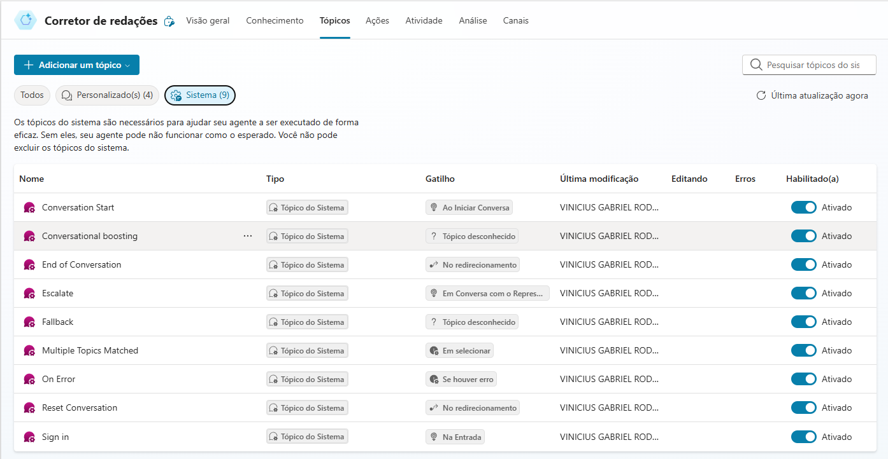
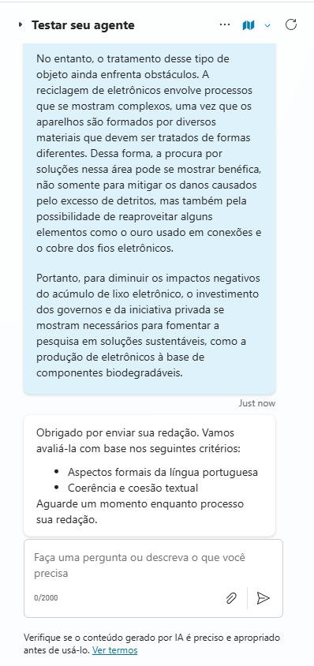

# Criando um Copiloto com Fluxo de Conversa Personalizado no Microsoft Copilot Studio

Atendendo ao desafio de projeto do [bootcamp](https://web.dio.me/track/microsoft-copilot-studio), criei um simples agente com o objetivo de corrigir redações.

## Criação do agente

Comecei criando o agente em branco, personalizando suas configurações. O idioma escolhido para o agente foi o Inglês para habilitar funcionalidades de IA Generativa. O restante das configurações foram:

```
Nome: Corretor de redações

Descrição:
Este agente recebe redações, as lê, analisa, e fornece feedbacks para o usuário sobre a redação, atribuindo uma nota ao final.

Instruções:
Você é um corretor de redações. Quando solicitado pelo usuário, você deve receber o texto de uma redação, ler, analisar, avaliar e fornecer feedback sobre a redação para o usuário, atribuindo uma nota, de acordo com as regras definidas.
[REGRAS]
- A análise deve ponderar os aspectos formais da língua portuguesa;
- Você deve avaliar questões de coerência e coesão textual;
- A nota atribuída deve estar no intervalo de 0 a 100 pontos;
- Suas respostas devem ser em português brasileiro (pt-BR);
- Seu feedback para o usuário deve ser claro e explicativo, contendo dicas para ajudá-lo a melhorar a redação;
- Inclua pontos em que o escritor da redação deve focar nas próximas redações para alcançar notas maiores.
```


## Criando um tópico customizado

Com o agente criado, agora precisamos criar um tópico pesonalizado para receber a redação e fazer a análise da mesma. Desse modo, criei o tópico, utilizando a criação por descrição com o Copilot:


## Habilitando respostas generativas

Para melhorar a experiência de conversa, escolhi ligar a funcionalidade de IA Generativa para habilitar o Conversational Boosting e Orquestração:





Além disso, também habilitei entrada de imagens do usuário para o caso de correção de redações escritas a mão.

## Resultado

Após todas as configurações supracitadas, é hora de testar o agente:


O tópico personalizado está sendo corretamente detectado. Agora, o principal: a correção de redações. Enviei ao agente uma redação que fiz há mais de um ano e tinha salvo.




Análise completa do agente sobre a redação fornecida:

```
Aqui está a análise da sua redação:

Aspectos Formais da Língua Portuguesa
Ortografia e Gramática: A redação está bem escrita, sem erros ortográficos ou gramaticais significativos.
Pontuação: A pontuação está correta e bem utilizada, facilitando a leitura e compreensão do texto.
Vocabulário: O vocabulário é adequado e variado, demonstrando um bom domínio da língua portuguesa.
Coerência e Coesão Textual
Introdução: A introdução apresenta claramente o tema da redação, contextualizando a evolução tecnológica e sua relação com o acúmulo de lixo eletrônico.
Desenvolvimento: O desenvolvimento do texto é bem estruturado, abordando os impactos ambientais do lixo eletrônico e os desafios da reciclagem desses materiais. A argumentação é lógica e bem fundamentada.
Conclusão: A conclusão propõe soluções para o problema apresentado, destacando a importância do investimento em pesquisa e desenvolvimento de tecnologias sustentáveis.
Pontos Fortes
Clareza e objetividade na exposição das ideias.
Boa estruturação do texto, com introdução, desenvolvimento e conclusão bem definidos.
Uso adequado de conectivos, garantindo a coesão entre os parágrafos.
Pontos a Melhorar
Detalhamento das Soluções: A conclusão poderia ser mais detalhada, apresentando exemplos específicos de iniciativas que já estão sendo implementadas ou que poderiam ser adotadas.
Exploração de Dados: Incluir dados estatísticos sobre o impacto do lixo eletrônico no meio ambiente poderia fortalecer a argumentação.
Nota
Com base na análise acima, sua redação recebe a nota de 85 pontos.

Dicas para Melhorar
Procure incluir dados e exemplos concretos para fortalecer sua argumentação.
Detalhe mais as soluções propostas, explorando como elas podem ser implementadas na prática.
Continue utilizando um vocabulário variado e mantendo a clareza e objetividade na exposição das ideias.
Parabéns pelo bom trabalho! Continue praticando e aprimorando suas habilidades de escrita.
```
